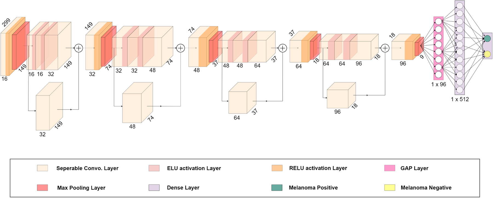

# Depthwise separable residual convolutional network

This Github repo aims to implement a novelty method described in the following paper "Diagnosis of melanoma from dermoscopic images using a deep depthwise separable residual convolutional network". 

To do so, I have respected all the preprocessing steps described in the paper, and reproduced the depthwise separable residual convolutional layers. 

Since I haven't found any implementation on the internet of the paper, I am happy to share with you my work :D. 

